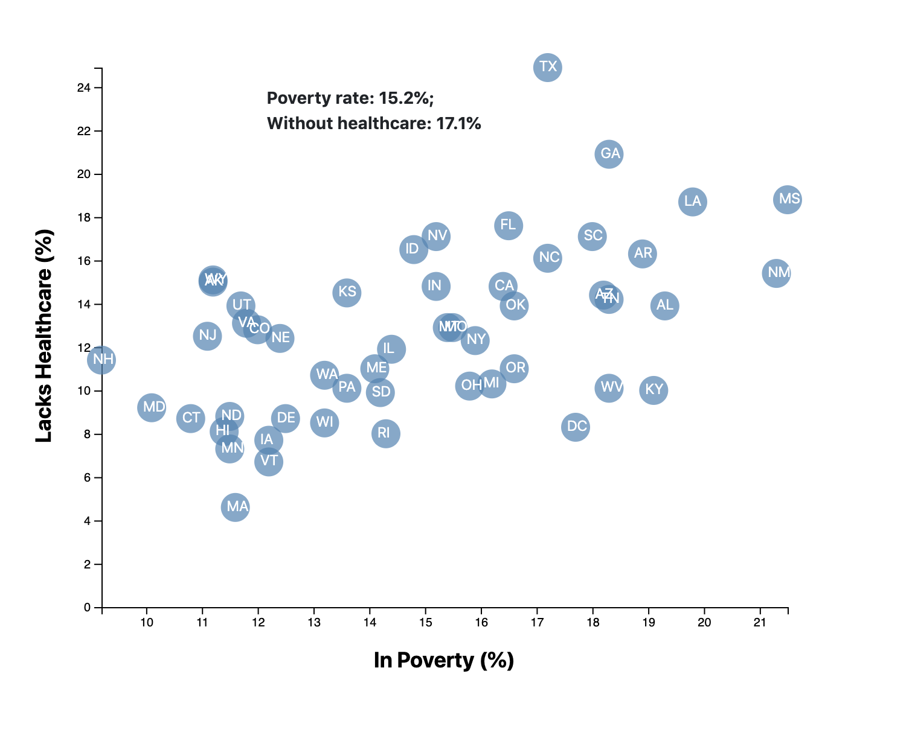

## U.S. Census Data Visualization with D3
This project aims to visualize the [2014 Y.S ACS Census Data](https://factfinder.census.gov/faces/nav/jsf/pages/searchresults.xhtml) data using D3.js. 

Scatterplot exploring the relationship between poverty rate and lack of health care in each of state is created.

`python -m http.server` is needed to run the visualization at `localhost:8000`. 

Output figure:
